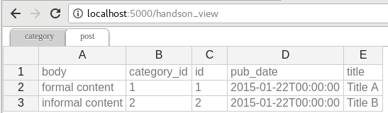

.. Flask-Excel documentation master file, created by
   sphinx-quickstart on Wed Jan 07 08:46:32 2015.
   You can adapt this file completely to your liking, but it should at least
   contain the root `toctree` directive.

`Flask-Excel` - 格式万变，数据不变
================================================================================

:作者: C.W.
:源文件: http://github.com/pyexcel-webwares/Flask-Excel.git
:提交问题: http://github.com/pyexcel-webwares/Flask-Excel/issues
:许可证: New BSD License
:发布的版本: |version|
:文档生成日期: |today|
以下是一段典型的开发人员和用户的对话::

     用户: "我上传了一个 excel 文件但是你的网页说文件格式不支持。"
  开发人员: "哪你上传的是 xlsx 格式还是 csv 格式？"
     用户: "嗯，我不清楚。总之，我用的微软的 Excel 存的文件。哪一定是 excel 文件啦！"
  开发人员: "嗨，事情是这样：从第一天开始，你就没有告诉我要支持所有的 excel 格式。"
           "要么，将就一下。要么，把项目推迟 N 天。"

**Flask-Excel** 是基于 `pyexcel <https://github.com/pyexcel/pyexcel>`_ 软件库。它的使命是让大家
在网站开发的时候，轻松的在数据存成 excel 文件让用户下载和处理用户上传的 excel 文件。
它可以把 excel 数据转换成二维数组，一维的字典数组和以excel 单页名为关键字，二维数组为值的字典；反之亦然。
这样的话，任由文件格式变化，你都可以在以下三个场景自由做数据转换:

#. excel 文件上传和下载
#. 数据库输入输出
#. excel 数据分析和存储

同时，**Flask-Excel** 有以下两个保证:

#. 不管是任何文件格式，函数界面不变
#. 不管是数据存在哪里，函数界面不变

那么你就可以专注基于 Flask 的网站开发了。

最开始的时候，作者遇到一个可用性的问题：当一个简单的 excel 处理的网页交到用户手上的时候，
这些用户，像行政助理，人力资源管理人员，老会抱怨网页不好用。事实上，并不是所有人都知道
csv, xls, xslx 各有什么区别。与其花时间教育用户相关的微软办公室软件的用法，不如把
人类已知 excel 都给支持一下好了。同时为了在不修改代码情况下，我们能够通过装一个
插件就不一个新的 excel 格式支持了，**pyexcel** 的编程界面做了很好的抽象处理。在
整个 Python 社区，作者希望此软件包成为给 pandas 跑龙套的小包包。

可圈可点的性能：

#. 为 excel 数据导入数据库和从数据库输出数据为 excel 格式提供一站式服务
#. 把上传的 excel 文件直接转换成 Python 数据结构
#. 把 Python 数据结构转换为 excel 文件让用户下载
#. 在服务器里，把数据存成 excel 文件
#. 支持 csv, tsv, csvz, tsvz 格式。其他格式有以下软件包支持：

.. _file-format-list:
.. _a-map-of-plugins-and-file-formats:

.. table:: 文件格式插件列表

   ======================== ======================= =================
   包包名字                  文件格式                 依赖
   ======================== ======================= =================
   `pyexcel-io`_            csv, csvz [#f1]_, tsv,
                            tsvz [#f2]_
   `pyexcel-xls`_           xls, xlsx(read only),   `xlrd`_,
                            xlsm(read only)         `xlwt`_
   `pyexcel-xlsx`_          xlsx                    `openpyxl`_
   `pyexcel-ods3`_          ods                     `pyexcel-ezodf`_,
                                                    lxml
   `pyexcel-ods`_           ods                     `odfpy`_
   ======================== ======================= =================

.. table:: 专门读或写的插件

   ======================== ======================= =================
   包包名字                  文件格式                 依赖
   ======================== ======================= =================
   `pyexcel-xlsxw`_         xlsx(write only)        `XlsxWriter`_
   `pyexcel-libxlsxw`_      xlsx(write only)        `libxlsxwriter`_
   `pyexcel-xlsxr`_         xlsx(read only)         lxml
   `pyexcel-xlsbr`_         xlsb(read only)         pyxlsb
   `pyexcel-odsr`_          read only for ods, fods lxml
   `pyexcel-odsw`_          write only for ods      loxun
   `pyexcel-htmlr`_         html(read only)         lxml,html5lib
   `pyexcel-pdfr`_          pdf(read only)          camelot
   ======================== ======================= =================

插件使用指南
------------------------

从2020年开始，所有 pyexcel-io 的插件都需要至少 python 3.6 了。如果需要支持以前的
python 版本，请继续使用 0.5.x 。

除了 csv 文件， xls, xlsx 和 ods 文件都是一个压缩文件。里面都是 xml 文件。

只有专门的读写插件可以边读边用或者边转换边写。

如果管理所有已经装上了的插件呢？很简单，你可以用 pip 添加需要的插件，或者卸载不需要的插件。
如果你有不同的项目，而且项目的依赖不一样，作者推荐用 python 的 venv 来给你的每一个项目创建
一个新的虚拟 python 环境。有个别情况，两个插件需要共存，比如 pyexcel-ods 和 pyexcel-odsr，
前者可以写 ods 文件，但你需要后者来读 ods 文件。在这种情形下呢，你可以用 library 变量，
比如 get_array('my.ods', library='pyexcel-odsr')。

.. _pyexcel-io: https://github.com/pyexcel/pyexcel-io
.. _pyexcel-xls: https://github.com/pyexcel/pyexcel-xls
.. _pyexcel-xlsx: https://github.com/pyexcel/pyexcel-xlsx
.. _pyexcel-ods: https://github.com/pyexcel/pyexcel-ods
.. _pyexcel-ods3: https://github.com/pyexcel/pyexcel-ods3
.. _pyexcel-odsr: https://github.com/pyexcel/pyexcel-odsr
.. _pyexcel-odsw: https://github.com/pyexcel/pyexcel-odsw
.. _pyexcel-pdfr: https://github.com/pyexcel/pyexcel-pdfr

.. _pyexcel-xlsxw: https://github.com/pyexcel/pyexcel-xlsxw
.. _pyexcel-libxlsxw: https://github.com/pyexcel/pyexcel-libxlsxw
.. _pyexcel-xlsxr: https://github.com/pyexcel/pyexcel-xlsxr
.. _pyexcel-xlsbr: https://github.com/pyexcel/pyexcel-xlsbr
.. _pyexcel-htmlr: https://github.com/pyexcel/pyexcel-htmlr

.. _xlrd: https://github.com/python-excel/xlrd
.. _xlwt: https://github.com/python-excel/xlwt
.. _openpyxl: https://bitbucket.org/openpyxl/openpyxl
.. _XlsxWriter: https://github.com/jmcnamara/XlsxWriter
.. _pyexcel-ezodf: https://github.com/pyexcel/pyexcel-ezodf
.. _odfpy: https://github.com/eea/odfpy
.. _libxlsxwriter: http://libxlsxwriter.github.io/getting_started.html

.. table:: 其他的格式

   ======================== ======================= ================= ==================
   包包名字                  文件格式                 依赖               Python 版本
   ======================== ======================= ================= ==================
   `pyexcel-text`_          write only:rst,         `tabulate`_       2.6, 2.7, 3.3, 3.4
                            mediawiki, html,                          3.5, 3.6, pypy
                            latex, grid, pipe,
                            orgtbl, plain simple
                            read only: ndjson
                            r/w: json
   `pyexcel-handsontable`_  handsontable in html    `handsontable`_   same as above
   `pyexcel-pygal`_         svg chart               `pygal`_          2.7, 3.3, 3.4, 3.5
                                                                      3.6, pypy
   `pyexcel-sortable`_      sortable table in html  `csvtotable`_     same as above
   `pyexcel-gantt`_         gantt chart in html     `frappe-gantt`_   except pypy, same
                                                                      as above
   ======================== ======================= ================= ==================

.. _pyexcel-text: https://github.com/pyexcel/pyexcel-text
.. _tabulate: https://bitbucket.org/astanin/python-tabulate
.. _pyexcel-handsontable: https://github.com/pyexcel/pyexcel-handsontable
.. _handsontable: https://cdnjs.com/libraries/handsontable
.. _pyexcel-pygal: https://github.com/pyexcel/pyexcel-chart
.. _pygal: https://github.com/Kozea/pygal
.. _pyexcel-matplotlib: https://github.com/pyexcel/pyexcel-matplotlib
.. _matplotlib: https://matplotlib.org
.. _pyexcel-sortable: https://github.com/pyexcel/pyexcel-sortable
.. _csvtotable: https://github.com/vividvilla/csvtotable
.. _pyexcel-gantt: https://github.com/pyexcel/pyexcel-gantt
.. _frappe-gantt: https://github.com/frappe/gantt

.. rubric:: Footnotes

.. [#f1] 压缩了的 csv 文件
.. [#f2] 压缩了的 tsv 文件

安装
-------------------

你可以通过 pip 安装 Flask-Excel ：

.. code-block:: bash

    $ pip install Flask-Excel

或者复制到本地再安装：

.. code-block:: bash

    $ git clone https://github.com/pyexcel-webwares/Flask-Excel.git
    $ cd Flask-Excel
    $ python setup.py install

每个插件的安装方法都有各自的文档。拿 xlsx 为例，你需要装 pyexcel-xlsx ::

        $ pip install pyexcel-xlsx

配置
------------------------

在你的应用里，你必须加上以下的初始化代码：

.. code-block:: python 

    import flask_excel as excel

    ...
    excel.init_excel(app) # required since version 0.0.7

快速上手
--------------------------------------------------------------------------------

一个最简单的应用可以写这么短:

.. literalinclude:: ../../examples/tiny_example.py
   :linenos:

这个小应用有四个链接

#. 一个用来展示 Excel 文件上传。
#. 三个用来展示 Excle 文件下载。

第一个链接可以让你上传一个 Excel 文件，然后你会得到用 json 表示的文件内容。
你可以用这个准备好的
`样板文件 <https://github.com/pyexcel/Flask-Excel/blob/master/examples/example_for_upload.csv>`_
。当然你也可以用你自己的文件。在处理文件上传的代码里，我们用的是
:meth:`~flask_excel.ExcelRequest.get_array`
。**get_array** 的参数 **file** 其实已经写在了网页里了::

    <input ... name=file>

.. warning::
   如果 **field_name** 没有用到的话，你的浏览器会给出"Bad Request: The
   browser (or proxy) sent a request that this server could not understand."
   什么意思呢？正确的用法是：request.get_file(field_name='file') 。错误的用法是：
   request.get_array('file') 。
   

其余的链接呢，只要你用浏览器访问，它们会简单的回复一个 cvs 文件，比如：
http://localhost:50000/download/。在这里，我们展示了
:meth:`~excel.make_response_from_array` 如果把一个二维数组转换成你需要的 Excel 文件

更多的文件格式
------------------------

实例项目支持 csv, tsv 和他们的压缩版本: csvz and tsvz. 如果你需要其他的格式支持，
请参照:ref:`file-format-list`，你可以装一个或所有的::

    pip install pyexcel-xls
    pip install pyexcel-xlsx
    pip install pyexcel-ods

数据库：数据输入和输出
--------------------------------------------------------------------------------

继续前面的例子，我们来看看如果和数据库连起来。你可以把下面的代码拷贝到它们对应的地方，我们来
一起做。

    # insert database related code here

或者呢，你可以看这个已经完成了的`数据库例子 <https://github.com/pyexcel/Flask-Excel/blob/master/examples/database_example.py>`_

现在我们先加入这些引入::

    from flask_sqlalchemy import SQLAlchemy # sql operations

在你的命令行，运行下面的命令，装上 pyexcel-xls 和 pyexcel-handsontable::

	pip install pyexcel-xls, pyexcel-handsontable

接着我们配置数据库链接。在这里我们用 Sqllite 。你在当前目录可以找到 **tmp.db** ::

    app.config['SQLALCHEMY_DATABASE_URI'] = 'sqlite:///tmp.db'
    db = SQLAlchemy(app)

再拷贝数据库声明:

.. literalinclude:: ../../examples/database_example.py
   :lines: 38-69

然后创建数据库模型:

.. literalinclude:: ../../examples/database_example.py
   :lines: 71-73

再写一个数据输入的函数：

.. literalinclude:: ../../examples/database_example.py
   :lines: 75-100

解释一下，`category_init_func` 和 `post_init_func` 是给 Category 
和 Post 的自定义模型初始化函数。flask_excel 会把输入的 Excel 文件分批
一行一行的把数据给初始化函数。一般初始化函数返回数据库模型的实例。初始化函数的返回值有个特殊用途：
如果返回值是 None，哪所在的 Excel 文件的一行数据就会被丢掉。

我们再来写数据库输出的代码： 

.. literalinclude:: ../../examples/database_example.py
   :lines: 103-106

再运行一下，打开 Visit http://localhost:5000/import 
然后上传这个文件
`sample-data.xls <https://github.com/pyexcel/Flask-Excel/blob/master/sample-data.xls>`_.

你会得到下面的网页：

以上的页面是由 `pyexcel-handsontable <https://github.com/pyexcel/pyexcel-handsontable>`_ 生成的。
你需要做的就是用 'handsontable.html' 文件扩展名:

.. literalinclude:: ../../examples/database_example.py
   :lines: 115-119

Then visit http://localhost:5000/export to download the data back.

输出过滤过的查询
--------------------------------------------------------------------------------

前面的例子介绍了如果把一个或多个数据的表转换成 Excel 文件给用户下载。
现在这个例子讲讲如何过滤一个表然后给用户下载。
pass a query sets and an array of selected column names to
:meth:`~flask_excel.make_response_from_query_sets` 允许你给一个查询和选中的栏目名字
并给出一个单页的 Excel 文件下载：

.. literalinclude:: ../../examples/database_example.py
   :lines: 108-113

你可以打开这个链接看看：Then visit http://localhost:5000/custom_export 
.. _data-types-and-its-conversion-funcs:

所有支持的数据结构
--------------------------

示例应用展示了数列，并不代表只有数列，其他的数据结构也是支持的。 以下是所有的数据结构列表:

============================================== ======================================================== ==================================================
数据结构                                        从文件到数据结构                                           从数据结构到 http 回复
============================================== ======================================================== ==================================================
字典(dict)                                     :meth:`~flask_excel.ExcelRequest.get_dict`               :meth:`~flask_excel.make_response_from_dict`
字典列表（records)                             :meth:`~flask_excel.ExcelRequest.get_records`            :meth:`~flask_excel.make_response_from_records`
二维数组（a list of lists）                    :meth:`~flask_excel.ExcelRequest.get_array`              :meth:`~flask_excel.make_response_from_array`
以二维数组为值的字典(dict of a list of lists)  :meth:`~flask_excel.ExcelRequest.get_book_dict`          :meth:`~flask_excel.make_response_from_book_dict`
:class:`pyexcel.Sheet`                         :meth:`~flask_excel.ExcelRequest.get_sheet`              :meth:`~flask_excel.make_response`
:class:`pyexcel.Book`                          :meth:`~flask_excel.ExcelRequest.get_book`               :meth:`~flask_excel.make_response`
数据库表(database table)                       :meth:`~flask_excel.ExcelRequest.save_to_database`       :meth:`~flask_excel.make_response_from_a_table`
                                               :meth:`~flask_excel.ExcelRequest.isave_to_database`
一组数据库表(a list of database tables)        :meth:`~flask_excel.ExcelRequest.save_book_to_database`  :meth:`~flask_excel.make_response_from_tables`
                                               :meth:`~flask_excel.ExcelRequest.isave_book_to_database`
数据库查询（a database query sets）                                                                     :meth:`~flask_excel.make_response_from_query_sets`
字典产生器（a generator for records）          :meth:`~flask_excel.ExcelRequest.iget_records`
数组产生器（a generator of lists）             :meth:`~flask_excel.ExcelRequest.iget_array`
============================================== ======================================================== ==================================================

需要更多信息的话，可以参照 :ref:`pyexcel documentation<pyexcel:a-list-of-data-structures>`

支持
-----------------------

如果您觉得作者的付出对您有帮助，您可以给作者小女儿送个小玩具。谢谢您的支持！

.. image:: https://user-images.githubusercontent.com/4280312/98528713-979afe00-2274-11eb-9a98-8b3d75a83be2.png
   :width: 200

.. image:: https://user-images.githubusercontent.com/4280312/98529289-56efb480-2275-11eb-940f-be9f01ce0728.png
   :width: 200

函数参考
---------------

**Flask-Excel** 把 **pyexcel** 函数安插到了 :class:`flask.Request` 类里。

.. module:: flask_excel.ExcelRequest

ExcelRequest
******************

.. method:: get_sheet(field_name=None, sheet_name=None, **keywords)

   :param sheet_name: 对于多个表单的 excel 文件，它可以用来指定从哪一个表单取数据。缺省值是第一个表单。
                      要是 csv , tsv 文件的话，可以忽略 *sheet_name* 。
   :param keywords: 其他 :func:`pyexcel.get_sheet` 的参数
   :returns: :class:`pyexcel.Sheet`

   在下面的网页里， *field_name* 必须是 "file"::

       <!doctype html>
       <title>Upload an excel file</title>
       <h1>Excel file upload (csv, tsv, csvz, tsvz only)</h1>
       <form action="" method=post enctype=multipart/form-data>

       <input type=file name=file><input type=submit value=Upload>
       </form>

.. method:: get_array(field_name=None, sheet_name=None, **keywords)

   :param field_name: 和前面 :meth:`~flask_excel.ExcelRequest.get_sheet` 一样。
   :param sheet_name: 和前面 :meth:`~flask_excel.ExcelRequest.get_sheet` 一样。
   :param keywords: 其他 :func:`pyexcel.get_array` 的参数
   :returns: 二维数组（a list of lists）

.. method:: get_dict(field_name=None, sheet_name=None, name_columns_by_row=0, **keywords)

   :param field_name: 和前面 :meth:`~flask_excel.ExcelRequest.get_sheet` 一样。
   :param sheet_name: 和前面 :meth:`~flask_excel.ExcelRequest.get_sheet` 一样。
   :param name_columns_by_row: 栏目名在哪一样。缺省的话，默认栏目在第一行。
   :param keywords: 其他 :func:`pyexcel.get_dict` 的参数
   :returns: 字典

.. method:: get_records(field_name=None, sheet_name=None, name_columns_by_row=0, **keywords)

   :param field_name: 和前面 :meth:`~flask_excel.ExcelRequest.get_sheet` 一样。
   :param sheet_name: 和前面 :meth:`~flask_excel.ExcelRequest.get_sheet` 一样。
   :param name_columns_by_row: 栏目名在哪一样。缺省的话，默认栏目在第一行。
   :param keywords: 其他 :func:`pyexcel.get_records` 的参数
   :returns: 字典列表 (a list of records)

.. method:: get_book(field_name=None, **keywords)

   :param field_name: 和前面 :meth:`~flask_excel.ExcelRequest.get_sheet` 一样。
   :param keywords: 其他 :meth:`pyexcel.get_book` 的参数
   :returns: :class:`pyexcel.Book`

.. method:: get_book_dict(field_name=None, **keywords)

   :param field_name: 和前面 :meth:`~flask_excel.ExcelRequest.get_sheet` 一样。
   :param keywords: 其他 :func:`pyexcel.get_book_dict` 的参数
   :returns: 以二维数组为值的字典(dict of a list of lists) 

.. method:: save_to_database(field_name=None, session=None, table=None, initializer=None, mapdict=None **keywords)

   :param field_name: 和前面 :meth:`~flask_excel.ExcelRequest.get_sheet` 一样。
   :param session: SQLAlchemy 的 session
   :param table: 数据库的一个表
   :param initializer: 自定义的初始化函数
   :param mapdict: 表栏目适配字典
   :param keywords: 参照 :meth:`pyexcel.Sheet.save_to_database`

.. method:: isave_to_database(field_name=None, session=None, table=None, initializer=None, mapdict=None **keywords)

   和 :meth:`:meth:`~flask_excel.ExcelRequest.save_to_database` 一样但用更少的内存。

   同时要求上传文件的第一行是栏目名。

.. method:: save_book_to_database(field_name=None, session=None, tables=None, initializers=None, mapdicts=None, **keywords)

   :param field_name: 和前面 :meth:`~flask_excel.ExcelRequest.get_sheet` 一样。
   :param session: SQLAlchemy 的 session
   :param tables: 一组数据库表
   :param initializers: 一组自定义的初始化函数
   :param mapdicts: 一组表栏目适配字典。请注意，数据库表，初始化函数和栏目适配字典需要一一对应。
   :param keywords: 参照 :meth:`pyexcel.Book.save_to_database`

.. method:: isave_book_to_database(field_name=None, session=None, tables=None, initializers=None, mapdicts=None, **keywords)

   和 :meth:`:meth:`~flask_excel.ExcelRequest.save_book_to_database`. 一样但需要更少的内存

   同时要求上传文件的所有表的第一行是栏目名。

Response methods
**********************

.. module:: flask_excel

.. method:: make_response(pyexcel_instance, file_type, status=200, file_name=None)

   :param pyexcel_instance: :class:`pyexcel.Sheet` 或 :class:`pyexcel.Book`
   :param file_type: 任何一个支持的文件类型，以下是可用的但不局限于它们的集合

                     * 'csv'
                     * 'tsv'
                     * 'csvz'
                     * 'tsvz'
                     * 'xls'
                     * 'xlsx'
                     * 'xlsm'
                     * 'ods'

   :param status: 允许开发人员发自定义的 http status
   :param file_name: 自定义的下载文件名称。注意，文件扩展名是不能改变的。

.. method:: make_response_from_array(array, file_type, status=200, file_name=None)

   :param array: 二维数组（a list of lists）
   :param file_type: 和 :meth:`~flask_excel.make_response` 一样
   :param status: 和 :meth:`~flask_excel.make_response` 一样
   :param file_name: 和 :meth:`~flask_excel.make_response` 一样

.. method:: make_response_from_dict(dict, file_type, status=200, file_name=None)

   :param dict: 字典(dict) 
   :param file_type: 和 :meth:`~flask_excel.make_response` 一样
   :param status: 和 :meth:`~flask_excel.make_response` 一样
   :param file_name: 和 :meth:`~flask_excel.make_response` 一样

.. method:: make_response_from_records(records, file_type, status=200, file_name=None)

   :param records: 字典列表（records)
   :param file_type: 和 :meth:`~flask_excel.make_response` 一样
   :param status: 和 :meth:`~flask_excel.make_response` 一样
   :param file_name: 和 :meth:`~flask_excel.make_response` 一样

.. method:: make_response_from_book_dict(book_dict, file_type, status=200, file_name=None)

   :param book_dict: 以二维数组为值的字典(a dict of a list of lists)
   :param file_type: 和 :meth:`~flask_excel.make_response` 一样
   :param status: 和 :meth:`~flask_excel.make_response` 一样
   :param file_name: 和 :meth:`~flask_excel.make_response` 一样

.. method:: make_response_from_a_table(session, table, file_type, status=200, file_name=None)

   产生一个单页的 Excel 文件。里面的数据来自指定的数据库表。

   :param session: SQLAlchemy 的 session
   :param table: 数据库表
   :param file_type: same as :meth:`~flask_excel.make_response`
   :param status: same as :meth:`~flask_excel.make_response`
   :param file_name: same as :meth:`~flask_excel.make_response`

.. method:: make_response_from_query_sets(query_sets, column_names, file_type, status=200, file_name=None)

   产生一个单页的 Excel 文件。里面的数据来自查询结果。

   :param query_sets: 查询结果
   :param column_names: 指定的栏目名字。如果是 None 的话，不会有数据返回哦。
   :param file_type: 和 :meth:`~flask_excel.make_response` 一样
   :param status: 和 :meth:`~flask_excel.make_response` 一样
   :param file_name: 和 :meth:`~flask_excel.make_response` 一样

.. method:: make_response_from_tables(session, tables, file_type, status=200, file_name=None)

   产生一个多页的 Excel 文件。如果 *tables* 里只有一个数据库表的话，它的功能就和
   :meth:`~flask_excel.make_response_from_a_table` 一样了。

   :param session: SQLAlchemy 的 session
   :param tables: 一组数据库表
   :param file_type: 和 :meth:`~flask_excel.make_response` 一样
   :param status: 和 :meth:`~flask_excel.make_response` 一样
   :param file_name: 和 :meth:`~flask_excel.make_response` 一样

.. include:: ../../CHANGELOG.rst
